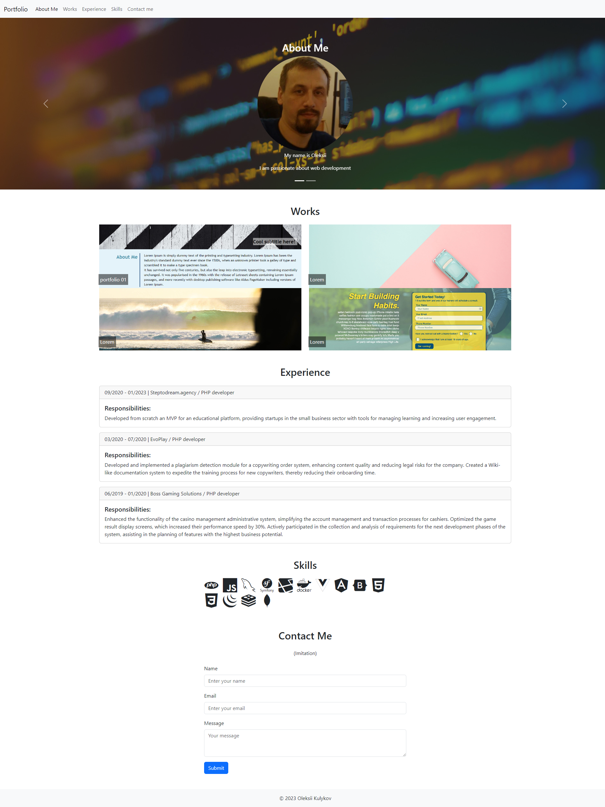

# oleksii-kulykov-portfolio/

## Description

The site can be accessed at https://oleksiieng.github.io/oleksii-kulykov-portfolio/

The following image shows the web application's appearance and functionality:




> **Note**: This layout is designed for desktop viewing, so you may notice that some of the elements don't look like the mock-up at a resolution smaller than 768px. Eventually you'll learn how to make elements responsive so that your web application is optimized for any screen size.


### User Story

```
For Challenge 2, we were tasked with creating a portfolio website.
```

### Website meets accessibility standards:

* Semantic HTML elements can be found throughout the source code
* HTML elements follow a logical structure independent of styling and positioning
* Image and icon elements contain accessible `alt` attributes
* Heading attributes fall in sequential order
* Title elements contain a concise, descriptive title
* Used flexbox, CSS Grid, media queries, and CSS variables

## Table of Contents

- [Installation](#installation)
- [Credits](#credits)
- [License](#license)

## Installation

To install this project:

1. Clone the repository to your local machine using `git@github.com:Oleksiieng/oleksii-kulykov-portfolio.git`.
2. Open the project in VS Code or any preferred IDE.
3. Ensure you have a live server extension installed, or use a local server to view the web application.

## Credits

Resources consulted for learning purposes:

- [Mozilla Developer Network (MDN)](https://developer.mozilla.org/)
- [W3Schools](https://www.w3schools.com/)
* [Semantic HTML](https://www.w3schools.com/html/html5_semantic_elements.asp)
* [Image `alt` attributes](https://www.w3schools.com/tags/att_img_alt.asp)

## License

This site licensed under the [MIT license](https://opensource.org/licenses/MIT).


